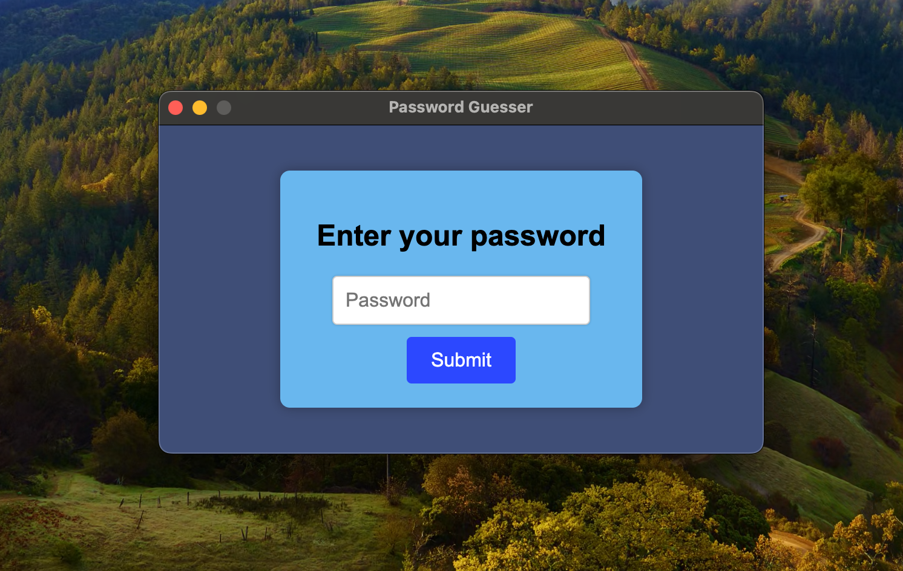
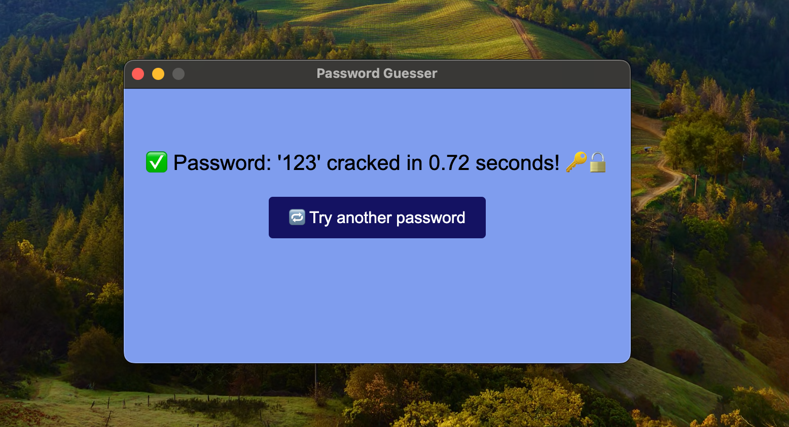
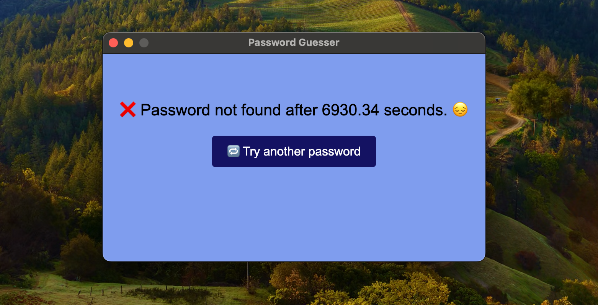

# 🔐 Password Cracker GUI

A fun and educational tool to explore password strength and entropy through a simulated cracking interface. This project visualizes how dictionary attacks and brute-force guessing work in real-time, encouraging users to reflect on password complexity.

## 🚀 Features

- 🧠 Simulates password cracking using dictionary-based strategies  
- 🖥️ Simple and responsive GUI using HTML, CSS, and JavaScript  
- ⏱️ Live status updates during the cracking process  
- 🔁 Retry and test different passwords easily  
- 🧩 Designed to demonstrate the trade-off between entropy and runtime  

## 📸 Demo
  
  
  

## 🧰 Tech Stack
- **HTML/CSS/JavaScript** — UI and core logic
- **Electron** — Desktop app wrapper (GUI execution environment)
- **Node.js** — Backend runtime for Electron and file operations

## 📂 Project Structure
analysis
├── plotting.py # Used for plotting data
└── stats.js    # Looks through data, conducts analysis, outputs to files.
app
├── index.html  # Main UI
├── style.css   # Basic styling
├── script.js   # Frontend logic & event handling
├── cracker.js  # Password cracking logic
├── data/       # Dictionarise
└── README.md

## 🔧 How to Use

1. Clone the repo:

   git clone https://github.com/yourusername/password-cracker-gui.git

2. Download electron with 'npm install --save-dev electron'

3. move into app via 'cd app' and

4. Download dictionaries from: [Compressed Dictionary](https://drive.google.com/file/d/1uX3ob-Bh0CTs0L3252EDRz2SwSI_RLt7/view?usp=drive_link)

5. Add dictionaries to app/data/ 

6. run 'npm start'

7. Enter a password and watch the cracker try to guess it!

8. Click Retry to test a different password.

## 🎓 Educational Purpose
This project is built to explore:
 - The importance of entropy in password security
 - How small changes (e.g. adding a special character) can vastly increase cracking time
 - Why dictionary attacks are effective on weak passwords

⚠️ Note: This tool is purely for educational use. It is not intended for real password cracking or unethical purposes.

## 📝 Final Thoughts
Creating this tool helped me appreciate the real-world impact of entropy and the cost of predictable passwords. Even small tweaks to the cracking strategy greatly affect runtime, revealing how even “clever-looking” passwords can fall to systematic guessing.

## 📄 License
MIT License. See LICENSE file for details.

